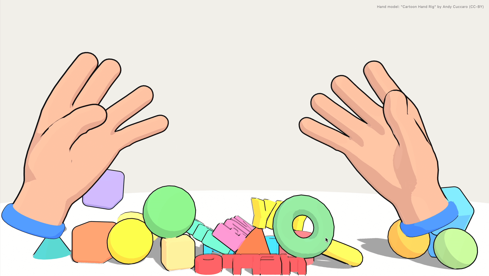

# MediaPipe Hand Tracking

Interactive hand-tracked toy experience built with MediaPipe, Three.js and Cannon-es, 🤖 Generated with Claude Code Fable

- <a href="https://hisamikurita.github.io/mediapipe-hand-tracking/">DEMO</a>



## Usage

* Clone repository
* Install Node.js
* Run following commands
```
  pnpm install
  pnpm dev
```

* Before deploying, run command for production.
```
  pnpm build 
```

## Credit 🙏

<a href="https://andycuccaro.gumroad.com/l/cartoon-hand-rig">Hand model: "Cartoon Hand Rig" by Andy Cuccaro (CC-BY)</a>
